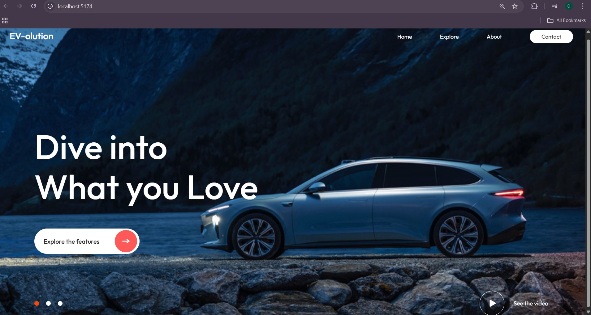

# 🚗 EV-olution – Static Electric Car Website Header

A **static website header design** built with **React** and **Vite**.  
This project is purely UI-based and showcases a modern electric vehicle landing page header with text, background image, and styled buttons.  
It does not include responsiveness or working navigation.

---

## 📸 Screenshot


---

## ✨ Features
- 🖼️ Static header section with EV car background image  
- 📝 Large hero text and tagline (e.g., "Dive into What you Love")  
- 🎨 Clean UI with modern fonts and styling  
- 🔘 Static buttons (Explore features, See the video)  
- ⚡ Built with **React + Vite** for fast setup  

---

## 🛠️ Tech Stack
- **React** – Frontend framework  
- **Vite** – Build tool  
- **CSS** – Styling  

---

## ⚙️ Installation & Setup

1. **Clone the repository**
   ```bash
   git clone https://github.com/your-username/ev-static-header.git
   cd ev-static-header
## Install dependencies and run the development server
 ```bash
npm install
npm run dev


